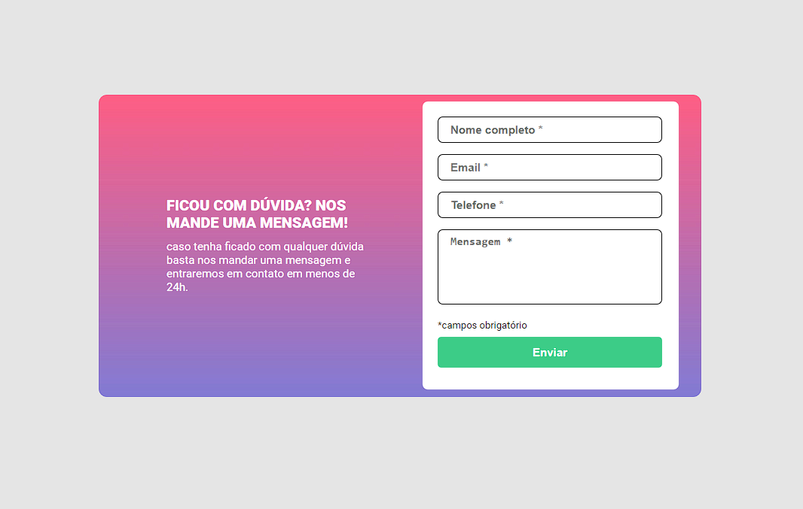
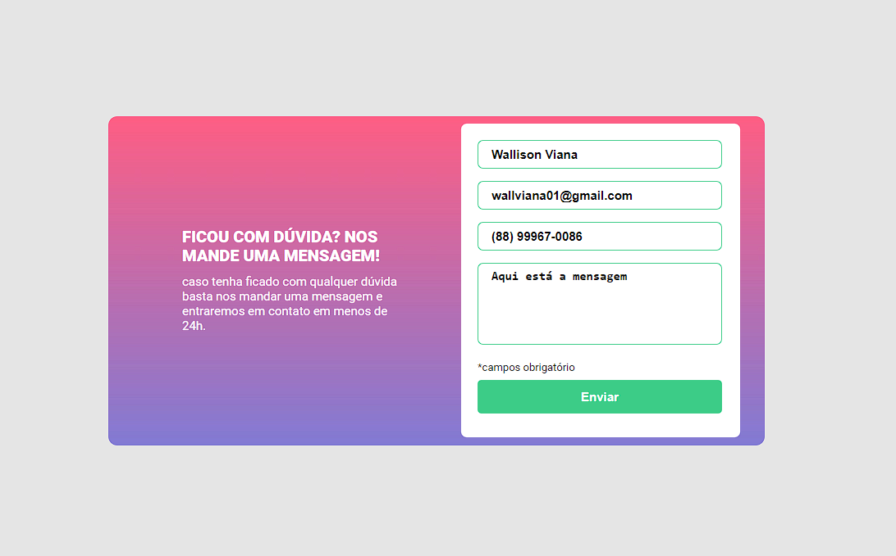
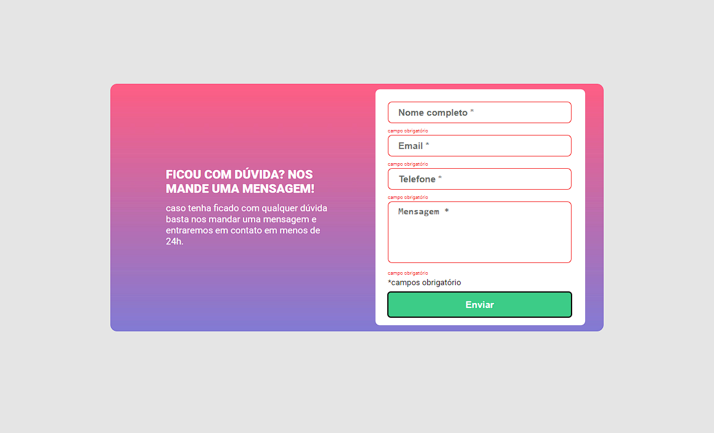

# Form with Validation.

This is a form with validation propouse by DevQuest.

## Overview

### Screenshot

The project is a query form with contact information using HTML, CSS and JS.

## My process

### Built with

- HTML5
- CSS
- Flexbox
- JavaScript

### What I learned

In this project I learned to use JS together with HTML and CSS to create websites that interact with the user in a more natural way.

## Author

- Github - [Wallison Viana](https://github.com/7Wall)
- Linkedin - [Wallison Viana](https://www.linkedin.com/in/wallison-viana-213389249/)